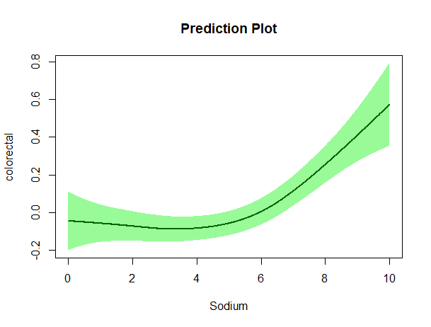
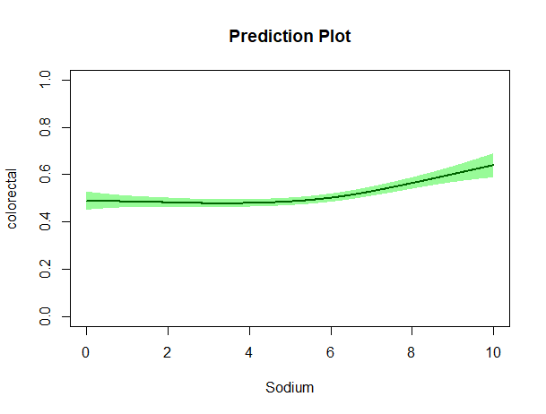

# scamplot

E. Christi Thompson

This package will develop a predictive plot of a logistic shape-constrained additive models. In order to apply some sort of shape constraint, it is important to first visualize the data to see which constraint would be beneficial for interpretation. The focus here is to make that process simpler by calling one function that does all the work for you.

First, the predictor variables are converted to numeric variables. Then the variables are sequenced off by their mean value, and the smooth predictor terms are also sequenced from their minimum to maximum values. A fomula is then created for the model based on user input as to which shape constraints to use. Finally, the information is fed into a function tha will generate the predictive plot.

## Installation

To install this package, copy and paste the code below into your console:
```r
library(devtools)
devtools::install_github("christithomp/scamplot")
```

## Usage

To use this package, copy and paste the code below into your console:
```r
library(scamplot)
```

### Prediction Plot for Spline Terms

To properly utilize this package, you first need to import data to be fit to a logistic, shape-constrained model.
```r
HEIdata = read.csv(paste(getwd(),"/data/Stat689_HEI.csv", sep = ''), header = TRUE)
```

Once the data is loaded, specify the response, smooth predictor, and linear predictor variable names to be fit in the model as well as the shape constraints you would like to implement.
```r
y = 'colorectal'
smooth_terms = 'Sodium'
linear_terms = 'gender'
shape_type = 'cr'
```

Finally, call the function within the package to get the prediction plot you desire. You can specify `type = 'link'` for the logistic model:
```r
make_scamplot(data = HEIdata, y = y, smooth_terms = smooth_terms, linear_terms = linear_terms, shape_type = shape_type, type = 'link')
```



You can also specify `type = 'response'` to get the probability model:
```r
make_scamplot(data = HEIdata, y = y, smooth_terms = smooth_terms, linear_terms = linear_terms, shape_type = shape_type, type = 'response')
```



## Details

For more information on this package, please access either the package documentations or [vignette](https://github.com/christithomp/scamplot/blob/master/vignettes/BostonMortgageVignette.Rmd). Any questions, comments, or concerns may be voiced to the author.
